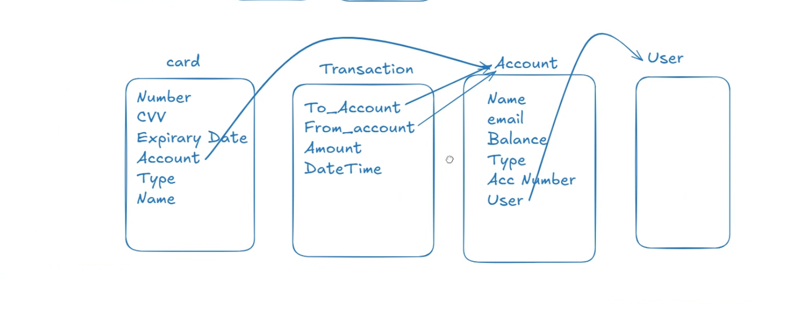
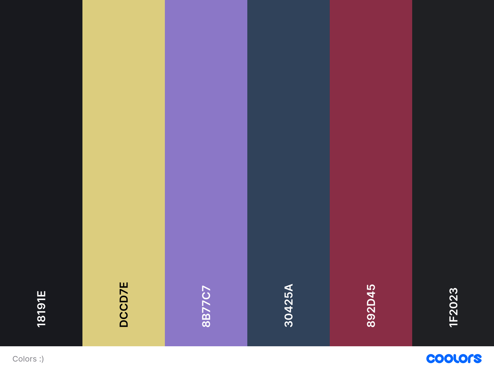
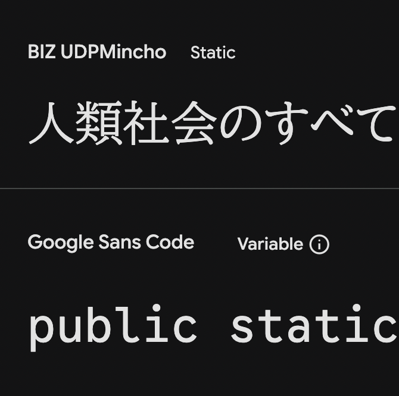

# Bankey - Capstone Project

*( For Code Institute Full Stack Developer Programme)*

## [CHECK THE DEPLOYED SITE HERE!](https://bankey-76bdd08d1577.herokuapp.com/)

(Might take a moment to warm up, the website is dormant while not used)

---

### Here's a full walktrhough of the deployed site

# Index

- [Overview](#overview)
- [UX Design](#ux-design)
- [User Stories](#user-stories)
- [ERD](#erd)
- [Colours](#colors)
- [Font](#font)
- [Key Features](#key-features)
- [User Authentication & Management](#user-authentication--management)
- [Dashboard Overview](#dashboard-overview)
- [Data Management](#data-management)
- [Deployment](#deployment)
- [AI Implementation & Orchestration](#ai-implementation--orchestration)
- [Testing](#testing)
    - [Desktop Lighthouse Reports](#desktop-lighthouse-reports)
    - [Mobile Lighthouse Reports](#mobile-lighthouse-reports)
    - [HTML Validation](#html-validation)
    - [CSS Validation](#css-validation)
    - [Python Validation](#python-validation)
    - [JavaScript Validation](#javascript-validation)
    - [Manual Testing](#manual-testing)
    - [Automated Testing](#automated-testing)
- [Future Enhancements](#future-enhancements)
- [Credits](#credits)

---

# Overview

Bankey is a blog disguised as a banking app where you can create your account, make cards and delete them,
send and receive imaginary money, and check your statement. There are no special differences with the different cards,
and the offers in the index page are sadly not met by this Bank. But regardless of the shortcomings in being a
functioning e-Bank, Banky manages to be a good showcase of CRUD and django, in addition to the awesome animations
and designs you can achieve with a bit of html and css. One thing to be aware of is that mobile was not first for this
project, most banks seem to have a totally different app and website. I was careful to have responsiveness for small 
screens, but in this case, it was not as important as the main desktop view.

This idea is made up of:

- 1 project
- 2 apps
- 1 css
- 1 main script
- 4 models
- 10 views
- 8 templates + 1 base (9)

 Read more... 

 
I came into this project expecting the functionality of a bank app to be very similar to a blog, which was the aim 
of the capstone, "make your own version of a blog". With a custom model, CRUD functionality and a using the
Object Oriented paradigms. But I actually thought I would be able to add commissions and timed charges for interest and
such things. I have to play with heroku and how it manages cron or other time managers. Maybe there is other
libraries for setting up a regular payment, or a date to charge a cardholder if they owe money on their credit card.

I really think it works fine for what it ended up being, but it's not something I'm happy with. Although
the idea of the project is "banking", it would require a lot more knowledge about security, pipelines,
and other aspects I currently ignore.

In general, I had thought of making a banking app because it appeared to me that it was a more math-demanding subject
for the capstone project. I like that. In the end, I didn't have time to add the functionality to charge transaction
fees, interest rates or other common calculations that happen during the banking experience, but perhaps in the future.

the timeline of the project basically was 3 weeks to get it to a more than "should have" level, but the couple of
issues I encountered in the first two weeks rendered models and deployment a longer task than anticipated. I spent
the first two weeks building most of the back end and the last week in designing and polishing what you end up
seeing now. the styles and templates.

Models were all custom, the User model was a bit more demanding given that the standard Django models don't have
a date of birth, and I was a bit stubborn in having it be part of the (utils.py) account number function.
The other problem I faced was databases, it seemed that my neon database was not set up properly somehow in settings.py,
this made it impossible to have a deployed version with a global database. The settings were for some reason just not
working in general, when trying to deploy in a local server the templates refused to connect, this was fixed by
rebooting the settings file and just connecting the dependencies and apps again. Aside from that, small problems like
styling and some bad pagination were fixed in the last couple of days.

All in all, the project's MVP felt finished, and I am happy to submit after sharing the heroku site with some CS friends
and my CI tutors and facilitators, having made improvements after hearing their comments. I hope to make many more, and
better apps in future hackathons, expanding on this idea and related subjects :)

---

# UX Design

The first idea of this simple look came about by remembering my first project, nervous health 
which had an easy navigation. The main feature I needed for the index was a CTA that conected to the key features,
and the rest could be filler content.

Dashboard wireframe vs Actual

 

Cards wireframe vs Actual

 

Statement wireframe vs Actual

 

Transaction wireframe vs Actual

 

### Templates reasoning 

My thought process for the templates was so:

 

I need to be able to display the "base" everywhere, this includes
the navbar and the footer only. So, I needed **base.html**.

I need to display a main page that informs the user of steps to take to sign up / log in, just as
important, we want to create an inviting feeling by communicating the value of joining the bank and the
advantages of different accounts and cards. So, I used **index.html**.

I wanted a feel of ease and brevity for the sign-up and log-in, so I use a different file for each. There is *
*log_in.html** and **sign_up.html**.

I took inspiration from my own (real) banking app and wanted to be able to show the customer's profile
in a way that was easy to use, and that only showed the most important data/information for the user's convenience.
Hence, I need **account.html**.

I also knew I needed a secure feel for the transactions, I wanted the look to help the user
focus more on their transaction so they could feel confident in typing and having the right info.
So I made **transactions.html**.

---

# User Stories

Must Haves

 

Could Haves

 

---

( ノ ^o^)ノ

---

# ERD

The Entity relationship models are essential. Mainly, to plan the look of the site, movement and interactitivity
of the user and the scope of the project.
Hence, they were looked at carefully and laid out from the inception of the project. Read more...

 

## Relationship Summary

| From          | To                     | Relationship | On Delete |
|---------------|------------------------|--------------|-----------|
| User          | BankeyAccount          | One-to-Many  | CASCADE   |
| BankeyAccount | Card                   | One-to-Many  | CASCADE   |
| User          | Transaction (sender)   | One-to-Many  | CASCADE   |
| User          | Transaction (receiver) | One-to-Many  | CASCADE   |
| Card          | Transaction            | One-to-Many  | SET_NULL  |

ERD cardinality Overview:

User
├── 0..* BankeyAccount
│ ├── 0..* Card
│ │ └── 0..* Transaction
│
├── 0..* Transaction (as sender)
└── 0..* Transaction (as receiver)

User (extends Django AbstractUser)

 

| Field Name  | Type          | Constraints               | Description                          |
|-------------|---------------|---------------------------|--------------------------------------|
| id          | AutoField     | PK                        | Unique user identifier               |
| username    | CharField     | unique, required          | Login username                       |
| email       | EmailField    | optional                  | User email address                   |
| first_name  | CharField     | optional                  | User first name                      |
| last_name   | CharField     | optional                  | User last name                       |
| full_name   | CharField     | auto-generated, read-only | Concatenation of first and last name |
| dob         | DateField     | null, blank               | Date of birth                        |
| password    | CharField     | required                  | Hashed password                      |
| is_active   | BooleanField  | default=True              | Account active status                |
| is_staff    | BooleanField  | default=False             | Admin access                         |
| date_joined | DateTimeField | auto                      | Registration timestamp               |

BankeyAccount

 

| Field Name  | Type              | Constraints | Description                |
|-------------|-------------------|-------------|----------------------------|
| id          | AutoField         | PK          | Unique account identifier  |
| user        | ForeignKey → User | CASCADE     | Account owner              |
| acc_balance | DecimalField      | default=0   | Total account balance      |
| acc_type    | IntegerField      | choices     | Personal / Business / None |
| acc_number  | CharField         | unique      | Generated account number   |
| currency    | CharField         | choices     | Account currency           |
| created_on  | DateTimeField     | auto        | Account creation timestamp |

Card

 

| Field Name      | Type                       | Constraints | Description               |
|-----------------|----------------------------|-------------|---------------------------|
| id              | AutoField                  | PK          | Unique card identifier    |
| account         | ForeignKey → BankeyAccount | CASCADE     | Owning account            |
| card_balance    | DecimalField               | default=0   | Card balance              |
| card_number     | CharField                  | unique      | Generated card number     |
| expiration_date | DateField                  | default     | Expiry date               |
| card_type       | IntegerField               | choices     | Debit / Credit / Business |
| created_on      | DateTimeField              | auto        | Card creation timestamp   |

Transaction

 

| Field Name | Type              | Constraints    | Description                    |
|------------|-------------------|----------------|--------------------------------|
| id         | AutoField         | PK             | Unique transaction identifier  |
| reference  | CharField         | blank          | Optional transaction reference |
| sender     | ForeignKey → User | CASCADE        | User sending funds             |
| receiver   | ForeignKey → User | CASCADE        | User receiving funds           |
| card       | ForeignKey → Card | NULL, SET_NULL | Card used (can be deleted)     |
| amount     | DecimalField      | required       | Transaction amount             |
| timestamp  | DateTimeField     | auto           | Transaction timestamp          |

This was the first sketch for the ERDs:

---

## Colors

The color palette was chosen very early on and stayed mostly unchanged throughout the project. I wanted something that
felt slightly artificial and glossy, closer to a “concept bank” than a real one...

 

...With gradients doing most of the heavy lifting. Dark backgrounds help the cards and UI elements pop, while the warmer 
gradients give the illusion of something 
friendly and premium, even if the functionality underneath is deliberately simple.

Most colours are defined as CSS variables in a single file, which made it easier to tweak contrast and visibility late
in the project without breaking layouts. This was especially useful when adjusting accessibility issues and making sure
that important information, such as balances and transaction states, remained readable across different screen sizes.

---

## Font

The two fonts are BIZ UDPMincho and Google Sans Code

 

Basically I looked for business fonts in google fonts and these two came up, I liked them, so I used them.
I chose BIZ serif for headings and identity, and a Google sans font for numbers and technical content
like card numbers and balances. This was done to subtly separate
“human” content from “system” content, even if most users would never consciously notice it.

The fonts are imported globally and referenced via CSS variables, which allowed consistent usage across templates. Font
sizes were adjusted several times during responsive testing, particularly for the card number display, which proved to
be more fragile than expected on smaller screens.

---

# Key Features

Creating cards and performing transactions are the focus of this app.

 

At its core, Bankey supports basic CRUD operations disguised as banking actions: users can create accounts, issue cards,
perform transactions, and review statements. None of these actions involve real money or real banking logic,
but they mimic the structure and flow of an online banking experience closely enough to serve the project’s goals.

The most visually prominent features are the animated cards, modal dialogs, and interactive tables. While these are not
strictly necessary for functionality, they help demonstrate how far HTML, CSS, and a small amount of JavaScript can go
when carefully combined with Django templates.

 

This short video goes through signing up, making an account and card. We create a transaction, send a few bucks
and checking a statement. We delete a card and log out... enjoy

 

---

# User Authentication & Management

 

Authentication is handled using Django’s built-in tools, with a custom User model added early on to support a
date of birth field. This decision added some complexity but allowed tighter control over account generation and
future expansion ideas, such as identity-based account numbers.

Login, signup, and logout flows are simple by design. Feedback to the user is provided through message banners rather
than page redirects wherever possible, keeping the experience fluid and reducing friction. While security is
intentionally lightweight for a demo app, the structure mirrors real-world patterns closely.

---

# Dashboard Overview

---

# Data Management

---

# Deployment

---

Using the Code institute plan for the students, I deployed the project to Heroku. Thanks to their eco dynos We are able
to host for free. The server is asleep until requested, it might need a moment to warm up.

# AI Implementation & Orchestration

---

# Testing

## Desktop Lighthouse Reports

---

## Mobile Lighthouse Reports

---

## HTML Validation

---

## CSS Validation

---

## Python Validation

---

## JavaScript Validation

---

## Manual Testing

---

## Automated Testing

---

# Future Enhancements

---

# Credits

_This project is dedicated to my unfinished degree in Economics and Finance in Portugal._
